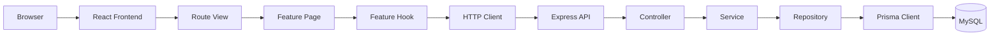
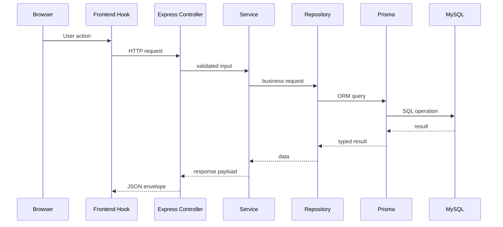

# Finance TS

Modern financial management web application built with React, TypeScript, Tailwind CSS, shadcn/ui, Framer Motion, Node.js, Express.js, Prisma ORM, and MySQL.

This project is designed as a premium fintech dashboard for tracking salary, monthly recurring expenses, daily spending, financial recommendations, and future forecasts in one place.

## Quick Snapshot

| Item | Value |
|---|---|
| Frontend | React + TypeScript + Vite |
| Styling | Tailwind CSS + shadcn/ui patterns |
| Motion | Framer Motion |
| Backend | Node.js v24.14.1 + Express.js |
| Database | MySQL |
| ORM | Prisma ORM v7 |
| Local Frontend URL | `http://localhost:5173` |
| Local Backend URL | `http://localhost:3000` |
| Health Check | `http://localhost:3000/health` |

This repository uses a single root `package.json`. Frontend and backend commands are both run from the project root.

## What This App Does

Finance TS helps users manage their money with a clear, visual, and easy-to-use interface.

It currently supports:

- base salary management
- monthly recurring expense tracking
- daily expense tracking
- spending recommendations
- financial forecasting
- localization in Indonesian and English
- light and dark theme switching

The application is built to feel like a polished personal-finance product rather than a developer demo. It uses clean wording, glassmorphism cards, and smooth motion to make the experience feel modern and premium.

## Who This Is For

This application is useful for:

- students learning personal finance
- freelancers tracking irregular income
- professionals managing salary and monthly obligations
- anyone who wants a structured view of income, spending, and future balance
- developers or university teams studying scalable full-stack architecture

## Tech Stack And Why It Was Chosen

| Technology | Role in the system | Why it is used |
|---|---|---|
| React | Frontend UI layer | A component-based UI makes the dashboard modular and easy to extend. |
| TypeScript | Frontend and backend typing | Keeps data contracts, form values, API shapes, and business rules safer and easier to refactor. |
| Tailwind CSS | Styling system | Enables fast, consistent UI styling with a design-token approach that fits the glassmorphism aesthetic. |
| shadcn/ui patterns | Reusable UI primitives | Supports clean, composable UI building blocks without a heavy component framework. |
| Framer Motion | Animation system | Provides smooth page transitions, card motion, and subtle interaction feedback. |
| Node.js | Runtime | Runs the backend and tooling in a single JavaScript/TypeScript ecosystem. |
| Express.js | API server | Simple and reliable HTTP layer with routing, middleware, and request lifecycle control. |
| Prisma ORM | Database access layer | Gives a type-safe way to read and write MySQL data while keeping schema and code aligned. |
| MySQL | Relational database | Fits well for financial records, relations, indexes, and normalized data. |

## Main Features

### Salary Management

Users can store a base salary profile with:

- monthly salary amount
- currency
- payday day
- effective date range
- active/inactive state

This salary profile is used by the rest of the app for budget calculations, recommendations, and forecasts.

### Monthly Recurring Expenses

Users can manage monthly obligations such as:

- rent
- electricity
- internet
- subscriptions
- other recurring bills

The feature supports:

- create
- edit
- delete
- recurring totals
- next due date calculation
- category grouping

### Daily Expenses

Users can record day-to-day spending with:

- selected date
- past date entry
- category selection
- merchant name
- notes
- daily totals
- spending history

### Recommendation Engine

The app calculates:

- a daily spending limit
- a savings target
- holiday and weekend spending adjustment
- overspending detection
- spending behavior signals

The UI only displays the result. The actual calculations stay in backend services and shared utility functions.

### Financial Forecasting

The forecast system simulates future balance based on:

- base salary
- recurring expenses
- daily spending
- scenario multipliers

It supports multiple future paths so the user can understand conservative, balanced, and stretch outcomes.

### Analytics

The application already reserves space for analytics and spending insights. The route is present in the navigation, and the backend route is mounted, but the full analytics experience is still planned for future expansion.

### Localization

The UI supports:

- Indonesian by default
- English as an alternate language

Language choice is stored locally so it stays consistent when users change pages.

### Theme Switching

The app supports:

- light mode
- dark mode
- system-aware theme detection at the provider level

The top bar uses Font Awesome sun/moon icons and the styling keeps the glassmorphism look in both modes.

---

## Architecture Overview



The application is built around a feature-based structure:

- pages decide what the user sees
- components render reusable UI blocks
- hooks manage local state and data loading
- services hold business logic
- repositories handle persistence

This keeps the codebase easy to extend without mixing responsibilities.

---

## Project Structure

### Root Level

| Folder/File | Purpose |
|---|---|
| `src/` | Frontend application code |
| `server/` | Backend API code |
| `prisma/` | Prisma schema and migrations |
| `shared/` | Reserved for future cross-app shared assets |
| `docs/` | Reserved documentation folder |
| `PROJECT_CONTEXT.md` | AI context and architecture reference |
| `ROADMAP.md` | Development phase plan |
| `DATABASE_PLAN.md` | Database planning reference |
| `FOLDER_STRUCTURE.md` | Folder structure guide |

### Frontend Structure

| Folder | Purpose | What belongs here |
|---|---|---|
| `src/app/` | App composition layer | Providers, route declarations, shell layout |
| `src/components/` | Shared UI layer | Buttons, cards, forms, modals, sidebar, navbar, loading and empty states |
| `src/features/` | Feature modules | Salary, monthly expenses, daily expenses, recommendations, forecasts, analytics, categories |
| `src/i18n/` | Localization system | Translation maps and translation hooks |
| `src/lib/` | Low-level utilities | API client, formatting, motion presets, navigation metadata, helpers |
| `src/providers/` | Global client state | Theme provider, locale provider |
| `src/styles/` | Global styling | Tailwind setup, theme variables, glassmorphism tokens |

### Backend Structure

| Folder | Purpose | What belongs here |
|---|---|---|
| `server/src/app.ts` | Express app composition | Middleware registration, router mounting, health endpoint |
| `server/src/server.ts` | Server bootstrap | Startup logic and development bootstrap work |
| `server/src/config/` | Environment and infrastructure config | Env parsing, logger setup, Prisma client setup |
| `server/src/middlewares/` | HTTP middleware | Validation, not found handling, centralized error handling |
| `server/src/modules/` | Feature modules | Auth, users, salaries, monthly expenses, daily expenses, categories, holidays, recommendations, forecasts, analytics, AI |
| `server/src/routes/` | API router assembly | Main `/api/v1` routing entry |
| `server/src/shared/` | Shared backend utilities | Common error objects, response shape, validation helpers, logging, calculation utilities, constants |
| `server/src/bootstrap/` | Startup helpers | Development bootstrap tasks such as demo user creation |

### Prisma Structure

| Folder/File | Purpose |
|---|---|
| `prisma/schema.prisma` | Single source of truth for the relational schema |
| `prisma/migrations/` | Migration history |
| `prisma.config.ts` | Prisma 7 connection configuration |

### How The Layers Work Together

- `pages` decide which feature view is shown.
- `components` stay presentational and reusable.
- `hooks` fetch data and manage local state.
- `api` modules call the backend and return typed results.
- `controllers` receive HTTP requests and pass work to services.
- `services` contain business rules and calculations.
- `repositories` handle database queries through Prisma.

Think of it like a restaurant:

- pages are the dining area
- components are the tables and utensils
- hooks are the waiter
- services are the kitchen rules
- repositories are the pantry and storage room

---

## Frontend Architecture

### Component Flow

The frontend follows a simple flow:

1. `App.tsx` renders the global providers.
2. `AppShell` wraps the dashboard layout.
3. `RouteView` decides which page to render from `window.location.pathname`.
4. Each feature page loads data through a feature hook.
5. Feature components render the data in reusable cards, forms, lists, and modals.

### Routing

The app currently uses pathname-based route rendering instead of a full router package.

Implemented frontend routes:

| Route | Page |
|---|---|
| `/` | Dashboard |
| `/salary` | Salary management |
| `/expenses` | Monthly expenses |
| `/daily-expenses` | Daily expense tracking |
| `/recommendations` | Financial recommendations |
| `/forecasts` | Financial forecasts |
| `/analytics` | Coming soon placeholder |
| `/holidays` | Coming soon placeholder |
| `/settings` | Coming soon placeholder |

### State Management Strategy

State is split into three layers:

- **Global state**: theme and language
- **Feature state**: form values, loading state, and API data inside hooks
- **UI state**: sidebar open/close, modal visibility, selected tabs, and local inputs

This keeps the application simple and avoids a heavy global state library too early.

### Reusable UI Strategy

Shared components include:

- `Button`
- `Card`
- `Badge`
- `Input`
- `Select`
- `Textarea`
- `Checkbox`
- `Modal`
- `FormField`
- `GlassCard`
- `SectionHeader`
- `LoadingState`
- `EmptyState`

These components let the app keep a consistent visual language across every feature.

### Styling System

The app uses:

- Tailwind CSS for utility-first styling
- CSS variables for theme tokens
- glassmorphism panels with blur and translucent surfaces
- responsive mobile-first layouts

### Animation System

Framer Motion powers:

- page entrance transitions
- card reveal animations
- staggered lists
- modal motion
- subtle hover feedback

The project uses reusable motion presets such as `fadeInUp` and `staggerChildren`.

### Localization System

Localization is built with:

- `LocaleProvider`
- `useTranslations`
- a central message map in `src/i18n/messages.ts`

Default language: Indonesian.

Language state is saved in localStorage, so the user does not lose their preference when navigating.

### Theme System

Theme state is handled by:

- `ThemeProvider`
- localStorage persistence
- `document.documentElement.dataset.theme`

The app supports dark and light appearance cleanly without breaking the glassmorphism aesthetic.

---

## Backend Architecture

### API Flow

1. The frontend sends a request through the root HTTP client.
2. Vite proxies `/api` requests to `http://localhost:3000`.
3. Express receives the request.
4. Validation middleware checks params, query, and body.
5. The controller handles HTTP concerns.
6. The service applies business rules.
7. The repository talks to Prisma.
8. Prisma reads or writes MySQL.
9. The API returns a consistent JSON envelope.

### Request Lifecycle



### Controller / Service / Repository Pattern

- **Controller**: receives the HTTP request and returns a response
- **Service**: contains business logic such as calculations and validation rules
- **Repository**: contains Prisma calls and database queries

This separation makes the backend easier to test and easier to expand.

### Validation System

The backend uses Zod schemas and a validation middleware to check:

- route params
- query strings
- request bodies

Invalid requests are rejected before they reach service logic.

### Error Handling

The backend uses:

- a custom `AppError`
- centralized error middleware
- a not-found middleware
- a consistent JSON response envelope

This keeps error messages predictable for the frontend.

### Environment Management

Environment variables are loaded from `.env` and validated with Zod in `server/src/config/env.ts`.

The backend refuses to start if required environment values are missing or invalid.

The current CORS middleware is permissive for local development, while `CORS_ORIGIN` is already prepared for tighter control in a later deployment stage.

In development mode, the backend also ensures a `demo-user` account exists so the finance features can be tested before authentication is added.

---

## Database Architecture

### Current Schema

The current Prisma schema focuses on the operational finance data:

| Table | Purpose |
|---|---|
| `users` | Owner account and account metadata |
| `salaries` | Base salary profiles |
| `categories` | Reusable category labels for expenses |
| `monthly_expenses` | Recurring monthly obligations |
| `daily_expenses` | Day-to-day spending entries |

Recommendations and forecasts are computed from these tables on demand rather than stored as dedicated core tables in the current schema.

### Relationships

- one user has many salary records
- one user has many categories
- one user has many monthly expenses
- one user has many daily expenses
- one category can be used by many monthly expenses
- one category can be used by many daily expenses

### Why The Tables Are Separated

Each table stores one kind of data:

- salary data changes less often than daily spending
- monthly expenses are recurring obligations
- daily expenses are transactional and date-based
- categories are reusable metadata

Separating these tables keeps the database clean, avoids duplicated information, and makes reporting easier.

### Normalization Strategy

The schema is designed to reduce duplication:

- category names are stored once and reused
- expense records reference category IDs instead of repeating names
- salary records are separated from expense records
- financial history stays in normalized tables for analysis

### Soft Delete Strategy

Instead of deleting everything permanently, most tables use `deletedAt` timestamps.

This allows:

- financial history retention
- safer auditing
- future analytics and forecasting

### Prisma Workflow

The project uses Prisma 7 with:

- `prisma/schema.prisma`
- `prisma.config.ts`
- `@prisma/adapter-mariadb`

Important note:

- the datasource URL is not stored in the schema file anymore
- the connection is configured through Prisma 7 project config

### Migration Workflow

Use Prisma migrations to keep schema changes versioned:

```powershell
npm run prisma:generate
npm run prisma:migrate
```

The initial migration already exists in `prisma/migrations/`.

---

## Current API Endpoints

All API routes are mounted under `/api/v1`.

### Health

| Method | Route | Purpose |
|---|---|---|
| GET | `/health` | Backend health check |

### Implemented Feature Endpoints

| Module | Method | Route | Purpose |
|---|---|---|---|
| Salaries | GET | `/api/v1/salaries/current/:userId` | Get active salary |
| Salaries | GET | `/api/v1/salaries/history/:userId` | Get salary history |
| Salaries | PUT | `/api/v1/salaries/current/:userId` | Save or update active salary |
| Monthly expenses | GET | `/api/v1/monthly-expenses/:userId` | Get overview |
| Monthly expenses | POST | `/api/v1/monthly-expenses/:userId` | Create recurring expense |
| Monthly expenses | PUT | `/api/v1/monthly-expenses/:userId/:expenseId` | Update recurring expense |
| Monthly expenses | DELETE | `/api/v1/monthly-expenses/:userId/:expenseId` | Delete recurring expense |
| Categories | GET | `/api/v1/categories/:userId` | List categories |
| Categories | POST | `/api/v1/categories/:userId` | Create category |
| Daily expenses | GET | `/api/v1/daily-expenses/:userId?date=YYYY-MM-DD` | Get daily overview |
| Daily expenses | POST | `/api/v1/daily-expenses/:userId` | Create daily expense |
| Daily expenses | PUT | `/api/v1/daily-expenses/:userId/:expenseId` | Update daily expense |
| Recommendations | GET | `/api/v1/recommendations/:userId` | Get recommendation snapshot |
| Forecasts | GET | `/api/v1/forecasts/:userId` | Get financial forecast |

### Reserved Routes

The following modules are mounted but still reserved for future work:

- auth
- users
- holidays
- analytics
- ai

They exist in the codebase so the project can expand without restructuring later.

---

## Environment Setup

### Current Environment Files

| File | Status | Purpose |
|---|---|---|
| `.env.example` | Present | Template for local setup |
| `.env` | Present | Local development secrets and config |

### Important Environment Variables

| Variable | Example | Purpose | Security Note |
|---|---|---|---|
| `NODE_ENV` | `development` | Controls runtime behavior | Use `production` for deployment |
| `PORT` | `3000` | Backend port | Avoid conflicts with other services |
| `DATABASE_URL` | `mysql://root@localhost:3306/finance_ts` | MySQL connection string | Never commit secrets |
| `CORS_ORIGIN` | `http://localhost:5173` | Reserved for future stricter origin control | The current server uses permissive CORS for local development |
| `LOG_LEVEL` | `info` | Logger verbosity | Use `warn` or `error` in production |
| `JWT_SECRET` | long random string | Reserved for auth signing | Must be at least 16 characters and kept secret |
| `RECOMMENDATION_*` | numeric values | Recommendation engine constants | Tune via environment, not hard-coded |
| `FORECAST_*` | numeric values | Forecast engine constants | Tune via environment, not hard-coded |

### Frontend Environment Variables

The current frontend does **not** require a separate `.env` file for runtime configuration.

It uses:

- Vite dev server proxy
- localStorage for theme and locale

If future public frontend variables are added, they should use the `VITE_` prefix.

---

## Installation Guide

### 1. Clone The Repository

```powershell
git clone <repository-url>
cd finance-ts
```

If you are already inside the project folder, just open the terminal at the root.

### 2. Install Dependencies

```powershell
npm install
```

What this does:

- installs frontend dependencies
- installs backend dependencies
- installs Prisma tooling
- updates `package-lock.json`

Common issue:

- **`npm install` fails because of network issues**
  - retry on a stable connection
  - make sure your package registry is reachable

### 3. Create The Database

Create a MySQL database named `finance_ts`.

Using SQL:

```sql
CREATE DATABASE finance_ts;
```

If you use Laragon, you can also create it through phpMyAdmin or HeidiSQL.

### 4. Configure Environment Variables

Copy the example file and edit it:

```powershell
copy .env.example .env
```

If you already have `.env`, make sure these values are correct:

```env
NODE_ENV=development
PORT=3000
DATABASE_URL="mysql://root@localhost:3306/finance_ts"
CORS_ORIGIN=http://localhost:5173
LOG_LEVEL=info
JWT_SECRET=your_long_random_secret
```

For Laragon:

- `root` is often the MySQL user
- password is often empty
- port is usually `3306`

### 5. Generate Prisma Client

```powershell
npm run prisma:generate
```

What this does:

- generates the Prisma client from `prisma/schema.prisma`
- keeps TypeScript database access in sync with the schema

Common issue:

- **Prisma schema validation errors**
  - make sure you are using the current Prisma 7 setup
  - the datasource URL is configured through `prisma.config.ts`, not in the schema file

### 6. Run Migrations

```powershell
npm run prisma:migrate
```

What this does:

- compares your schema with the database
- applies pending schema changes
- keeps the migration history in `prisma/migrations/`

If you only want to push the schema during early development:

```powershell
npx prisma db push
```

Use `db push` only when you understand that it syncs schema directly without creating a migration file.

### 7. Start The Application

```powershell
npm run dev
```

What this does:

- starts the backend in watch mode
- starts the frontend dev server
- runs both together with `concurrently`

Expected URLs:

- Frontend: `http://localhost:5173`
- Backend: `http://localhost:3000`
- Health check: `http://localhost:3000/health`

### 8. Optional: Open Prisma Studio

```powershell
npm run prisma:studio
```

What this does:

- opens a browser-based view of your database
- useful for checking rows while testing features

---

## Running The Project

### Frontend

The frontend runs on:

```text
http://localhost:5173
```

This is the page you will use to test:

- dashboard
- salary management
- monthly expenses
- daily expenses
- recommendations
- forecasts

### Backend

The backend runs on:

```text
http://localhost:3000
```

Health check:

```text
http://localhost:3000/health
```

### How To Verify It Works

1. Open `http://localhost:3000/health`
2. Open `http://localhost:5173`
3. Navigate through the sidebar
4. Save a salary profile
5. Add recurring expenses
6. Add daily expenses
7. Review recommendations and forecasts

If the health check works and the frontend loads, the project is running correctly.

---

## Useful Scripts

| Script | Command | Purpose |
|---|---|---|
| `dev` | `npm run dev` | Start frontend and backend together |
| `dev:server` | `npm run dev:server` | Start only the backend in watch mode |
| `dev:client` | `npm run dev:client` | Start only the frontend dev server |
| `build` | `npm run build` | Build the frontend for production |
| `preview` | `npm run preview` | Preview the production frontend build |
| `prisma:generate` | `npm run prisma:generate` | Generate Prisma Client |
| `prisma:migrate` | `npm run prisma:migrate` | Run Prisma migrations |
| `prisma:studio` | `npm run prisma:studio` | Open Prisma Studio |

> Note: `npm run test` is still a placeholder in the current setup and does not run a real test suite yet.

---

## Development Workflow

### Recommended Git Workflow

Use small, focused branches:

- `feat/salary-form`
- `feat/monthly-expenses`
- `fix/theme-toggle`
- `docs/readme-update`

Recommended flow:

1. create a feature branch
2. implement one feature at a time
3. run `npm run build`
4. verify the UI manually
5. merge only after the feature is stable

### Commit Convention

Use clear commit messages such as:

- `feat: add daily expense modal`
- `fix: preserve theme preference`
- `docs: update readme`
- `refactor: simplify recommendation controls`

### AI-Assisted Development Workflow

This project was built with AI assistance, but the working style remains disciplined:

- keep planning docs separate from runtime code
- verify actual implementation before documentation
- make incremental changes
- run build after major UI or API updates
- keep business logic out of UI components

This approach keeps the codebase understandable for both humans and AI collaborators.

---

## UI/UX Philosophy

### Glassmorphism

The design uses:

- blurred panels
- translucent cards
- soft borders
- layered shadows
- subtle gradients

This gives the dashboard a premium fintech look without feeling overly busy.

### Fintech Aesthetic

The UI is intentionally:

- clean
- calm
- data-focused
- easy to scan

The wording is written for normal users, not developers.

### Responsive Design

The app is mobile-first:

- the sidebar becomes a drawer on mobile
- top navigation stays compact
- cards reflow for smaller screens
- forms use stacked layouts on narrow screens

### Accessibility Considerations

The app includes:

- readable text contrast
- keyboard-friendly buttons
- clear focus states
- visible labels and descriptions

### Dark Mode Philosophy

Dark mode is not treated as a separate design. It is the same layout with theme-aware tokens, so the UI stays consistent and premium in both modes.

---

## Recommendation And Forecasting Logic

### Recommendation System

The recommendation engine calculates:

- how much can be spent per day
- how much should be saved
- how weekends and holidays affect spending
- whether the user is overspending
- what spending patterns appear over time

The important part is that the UI does not do the math directly. The frontend only displays the result. The backend owns the financial rules.

### Forecasting System

The forecasting system simulates future balance using scenarios such as:

- conservative
- balanced
- stretch

It helps the user understand:

- how spending today changes future balance
- how much money may remain later in the month
- which path is safer for savings

### Why Calculations Are Separated From UI

Separating calculations from the UI makes the app:

- easier to test
- easier to debug
- easier to reuse in other features
- safer to change without breaking the interface

The shared calculation helpers live in `server/src/shared/utils/financial-calculations.ts`, while the feature services apply the app-specific logic.

---

## Database And Prisma Workflow In Practice

1. Update `prisma/schema.prisma`
2. Run `npm run prisma:generate`
3. Run `npm run prisma:migrate`
4. Check the results in Prisma Studio if needed
5. Update repository/service code if the schema changed

This keeps the database schema and the TypeScript code aligned.

---

## Troubleshooting

### `npm install` Fails

Possible causes:

- unstable internet
- registry issues
- local lockfile conflicts

Fix:

- retry `npm install`
- clear npm cache if needed
- ensure you are using a supported Node.js version

### Prisma Authentication Error

If you see `P1000`, the MySQL username or password is wrong.

Fix:

- verify Laragon MySQL credentials
- check the `DATABASE_URL`
- make sure the database exists

### Prisma Schema Error

If you see `P1012` or a datasource-related message:

- make sure the project uses the current Prisma 7 setup
- the schema should not contain the old `url = env("DATABASE_URL")` line
- use `prisma.config.ts` and the Prisma adapter configuration instead

### Database Connection Error

If the backend cannot connect:

- confirm MySQL is running
- confirm `DATABASE_URL` points to the correct host and port
- confirm the database name matches

### Port Conflict

If `EADDRINUSE` appears on port `3000`:

- another backend instance is already running
- stop the old process or change the port

### Missing Environment Variables

If the backend refuses to start:

- check `.env`
- confirm `DATABASE_URL`
- confirm `JWT_SECRET`
- confirm numeric recommendation and forecast values are valid

### TypeScript Errors

If TypeScript complains after changes:

- check your imports
- check route keys
- check translation keys
- check shape changes in Prisma models and feature types

---

## Future Improvements

The architecture is ready to grow into the following areas:

- AI-assisted spending insights
- mobile app
- cloud deployment
- notifications and reminders
- richer charts and analytics
- machine learning-based behavior prediction
- authentication and real user accounts
- multi-currency support

These features can be added without rewriting the core structure.

---

## Notes For Presentations And Portfolio Use

This project is suitable for a university presentation or portfolio showcase because it demonstrates:

- full-stack TypeScript design
- separation of concerns
- relational database modeling
- reusable UI architecture
- local persistence and theme handling
- deterministic financial calculations
- scalable feature-based structure

If you are presenting the project, a simple explanation is:

> Finance TS helps users understand their salary, track spending, and make smarter financial decisions through a clean dashboard, smart calculations, and responsive design.

---

## Current Status

The project currently has:

- working frontend build
- working backend server
- Prisma-powered database integration
- local theme and language switching
- core financial features implemented
- placeholder routes reserved for future expansion

If you want to continue development, the most natural next steps are:

1. implement authentication
2. add analytics pages
3. add real chart visualizations
4. expand recommendations with historical trends
5. connect future notification and AI layers
